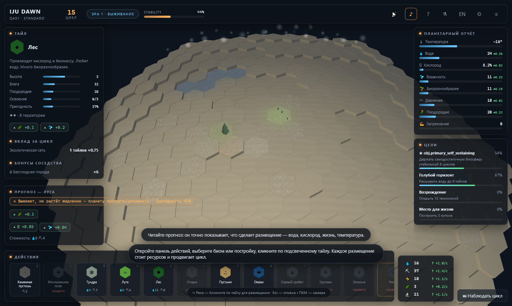

# TERRAFORM

**A single-player planetary terraforming strategy game that runs in your browser.**
Одиночная стратегия о терраформировании планеты, которая работает прямо в браузере.

A dead rock orbits a distant star. You are the last automated command: place biomes and
structures on a hex planet, grow living networks, tune a breathing climate system, survive
planetary events, and turn barren regolith into a self-sustaining world — before the
ecosystem collapses.



## Play / Запуск

```bash
npm install
npm run dev        # development server → open the printed URL
# or
npm run build && npm run preview   # production build
```

No account, no servers, no telemetry. All state lives in your browser (localStorage).

## Controls / Управление

| Input | Action |
|---|---|
| Left drag | pan / сдвиг камеры |
| Right drag | orbit / орбита |
| Wheel, `+`/`-` | zoom / масштаб |
| Arrows / WASD, Q/E | pan & orbit |
| Click a tray item (or `1`–`9`) | select what to place |
| Hover a glowing tile | live placement preview with exact numbers |
| Left click | place (advances one **Cycle**) |
| `T` | technology tree |
| `F` | focus home hub |
| `G` | hex grid · `O` ecological networks overlay |
| `Space` | observe one cycle (wait) |
| `M` | mute · `Esc` cancel / menu |

Every placement advances one cycle. There is no "end turn" button — the planet only
rests when you watch it.

## Core loop / Основной цикл

SCOUT → PLACE → CONNECT → TERRAFORM → HARVEST → RESEARCH → EXPAND → BALANCE → RESTORE

- **12+ biomes** emerge from interacting planetary variables: temperature, water, oxygen,
  humidity, biodiversity, pressure, fertility. Placement requirements are physical, not arbitrary.
- **5 resources** (water, minerals, energy, biomass, research) produced *by the landscape itself*;
  adjacency and living networks multiply yields.
- **Combos** (Watershed, Thriving Forest, Power Grid, Hotspot, Oasis…) form when tiles touch
  in the right way — chain reactions spread life downhill and along rivers.
- **The climate is a feedback system.** Forests raise humidity; humidity warms the world;
  clouds cool it; ice reflects light; industry pumps greenhouse gases and pollution.
  Push too hard and you get storms, eruptions and diebacks — the planet fights back.
- **24 technologies** in 6 branches. Unlocks don't just add numbers: new biomes, structures,
  climate interventions, range.
- **Events & decisions**: solar flares, meteor strikes, aurora gifts — some are random
  disasters, some are choices between trade-offs, all are yours to resolve.
- **Victory**: hold a self-sustaining biosphere stable for 8 cycles. **Defeat**: stability
  collapses. Both endings produce a full **Planetary Report** with a transformation replay
  of your world.

## Challenge modes

Standard · Planet of the Day (shared seed) · Arid · Frozen · Volcanic · Ecological · Hardcore

## Architecture

```
src/
  core/      hex math + deterministic RNG (sfc32) — zero dependencies
  sim/       pure deterministic simulation: state, generation, climate, adjacency,
             events, tech, objectives, victory, serialization  (no DOM, no THREE)
  render/    WebGL renderer: instanced hex prisms, per-vertex biome blending via color
             texture, animated water, instanced vegetation, GPU particles, clouds, sky,
             adaptive quality governor (ULTRA…LOW)
  ui/        premium DOM HUD: tray, inspector, previews, tech tree, modals, menu,
             report with replay, dev-only debug overlay
  audio/     100% procedural WebAudio ambience & SFX — grows with the biosphere
  i18n.ts    full EN/RU localization with live switch
  save/      localStorage saves + settings + best scores per mode
```

The simulation is deterministic and serializable: the same seed + the same actions always
produce the same planet. A snapshot of the world is taken every few cycles — that is what
the report replays.

### Determinism guarantee

`stateHash()` over the whole state is asserted in tests; the same action sequence from the
same seed must produce byte-identical states. Events, chain reactions and succession all
thread the RNG state inside `GameState`.

## Testing

```bash
npm test          # 9 determinism/balance/range/save tests for the sim (bundled by vite)
npm run build     # tsc --noEmit + production bundle
node qa/smoke.mjs # headless Chrome QA: console must be error-free, real clicks,
                  # placement through raycast picking, pixel probe, language switch
node qa/probe-biomes.mjs # pixel spot-check: biome colors, water surfaces render
node qa/idle.mjs         # game-design guard: pure "wait" spam must not win or snowball
```

(`qa/smoke.mjs` expects `npm run preview` on port 4173, and a local Chrome — see `CHROME`
env var; screenshots land in `qa/shots/`.)

## Accessibility

Reduced motion · high contrast · colorblind mode (redundant glyph coding) · keyboard-only
play (1–9 hotkeys, full navigation) · UI scale · all music/SFX sliders default to on, mute
is one keypress.

## Tech

TypeScript · Vite · three.js — one runtime dependency, no build-time asset pipeline,
no images, no audio files. Everything is generated at runtime.

*Built to run at 60 FPS with a single instanced draw call for the whole planet surface.*
